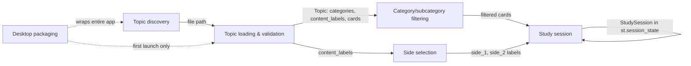

# MemorIRG — Project Blueprint

MemorIRG is a personal, local-first flashcard app for macOS. It has no fixed "question/answer" schema: you drop a CSV file into a folder, and every column that isn't reserved metadata becomes a possible card side. Someone studying English/Spanish/Italian vocabulary, world capitals, art history, or any other paired-fact list adds a CSV with the right shape and the app turns it into a shuffled study deck with flip-to-reveal cards, without touching code or a database. It ships both as a browser-based Streamlit app (dev mode) and as a native double-clickable `.app` bundle (packaged mode) built with PyInstaller + pywebview.

## Feature inventory

### Topic discovery (sidebar)

- **What it does** — On load, the app scans the data folder for `*.csv` files and lists them alphabetically in a sidebar dropdown ("Topic"). Picking one loads that CSV into a study deck. The topic name shown in the UI is derived from the filename (`world_capitals.csv` → "World Capitals": underscores/hyphens become spaces, title-cased).
- **Why it exists** — *(confirmed, CLAUDE.md / topic_service.py docstring)* Adding a new deck should require nothing but dropping a file in a folder and reloading the page — no registration step, no config file, no code change.
- **Inputs / outputs** — Reads: the data directory (`data/` in dev, `~/Library/Application Support/MemorIRG/data/` when packaged). Outputs: a `{topic_name: file_path}` registry, cached per Streamlit session via `@st.cache_data`.
- **Relates to** — Feeds Topic loading & validation and Category/subcategory filtering.

### Topic loading & validation

- **What it does** — When a topic is selected, its CSV is read, cleaned, and validated before anything is shown. If the file is malformed, empty, or has too few usable columns, the sidebar shows a specific, human-readable error instead of the app crashing or showing a broken deck.
- **Why it exists** — *(confirmed, file_loader.py / validators.py docstrings)* CSV is the only persistence layer with no schema enforcement at write time, so defensive read-time validation is where data quality is guaranteed. The cleaning pipeline (UTF-8 with latin-1 fallback → normalize column names to lowercase → strip cell whitespace → drop empty rows → drop exact duplicate rows) exists because these files are hand-edited by the user, not machine-generated.
- **Inputs / outputs** — Reads: one CSV file. Outputs: a `Topic` domain object (name, available categories/subcategories, ordered content labels, list of `FlashcardRecord`s, each assigned a fresh UUID at load time).
- **Relates to** — Depends on Topic discovery for the file path. Feeds Category/subcategory filtering and Side selection.

### Category / subcategory filtering

- **What it does** — If a CSV has a `category` column (and optionally `subcategory`), the sidebar shows filter dropdowns seeded with "All" plus every distinct value found in the data. Subcategory options narrow automatically to only those linked to the selected category. Selecting a category resets the subcategory choice to "All". If the chosen filter combination matches zero cards, the sidebar shows a warning and disables the Start button.
- **Why it exists** — *(confirmed, deck_service.py docstring)* `category`/`subcategory` are optional metadata columns, reserved so they're never mistaken for content — e.g. `languages.csv` has `category=animals, subcategory=farm` alongside three language columns; `musica.csv` has no category columns at all and the filters simply don't render.
- **Inputs / outputs** — Reads: the loaded `Topic`'s cards. Outputs: a filtered `list[FlashcardRecord]` passed to session creation.
- **Relates to** — Depends on Topic loading & validation. Feeds Study session creation.

### Side selection

- **What it does** — Two dropdowns, "Side 1 (shown first)" and "Side 2 (revealed on flip)", let the user pick which CSV columns play which role for the current study session — e.g. for `languages.csv` (english/spanish/italian) the user could choose english→italian instead of the default first-two-columns pairing. Picking the same label for both sides auto-swaps the other one so the two selections are never identical.
- **Why it exists** — *(confirmed, deck_service.py + sidebar.py docstrings)* Content columns are dynamic and unordered from the app's point of view, so nothing hardcodes "front" vs "back" — the user decides per session which two columns matter, and the swap-on-conflict behavior is a deliberate UX guard against two visually-identical card sides.
- **Inputs / outputs** — Reads: the topic's `content_labels`. Outputs: `(side_1_label, side_2_label)` strings passed into session creation.
- **Relates to** — Depends on Topic loading & validation. Feeds Study session creation.

### Study session (shuffle, flip, navigate)

- **What it does** — Pressing "Start Session" shuffles the filtered deck once and shows one card at a time, front side first. "Flip card" reveals side 2. "Next"/"Previous" move through the shuffled order (flip state always resets to side 1 on arrival at a new card). Reaching the end shows a "Session complete!" panel; pressing Previous from there steps back into the deck rather than staying stuck. Changing the topic mid-session doesn't kill the session silently — the app prompts to press Start again before showing anything new.
- **Why it exists** — *(confirmed, session_service.py / models.py docstrings)* The session is deliberately immutable — every navigation function (`go_next`, `go_previous`, `flip_card`) returns a brand-new `StudySession` via `dataclasses.replace()` rather than mutating state in place. This exists specifically to make Streamlit's rerun-the-whole-script execution model tractable: state transitions are explicit, testable in isolation, and never leave a half-mutated object sitting in `st.session_state` between reruns. The deck is shuffled exactly once at session creation and never re-shuffled during navigation, so "Previous" always retraces the same order.
- **Inputs / outputs** — Reads: filtered cards + chosen sides from the sidebar. Outputs: a `StudySession` stored in `st.session_state["session"]`, replaced (not mutated) on every interaction.
- **Relates to** — Depends on Category/subcategory filtering and Side selection. Is the terminal feature of the user flow — nothing downstream of it.

### Desktop packaging (native macOS app)

- **What it does** — `./build_desktop.sh` produces `dist/memorIRG.app`, a double-clickable native app with no visible terminal. On first launch it copies the bundled default CSVs into `~/Library/Application Support/MemorIRG/data/`; every launch after that leaves existing user CSVs untouched (purely additive, never overwrites or deletes). Users can drop their own CSVs into that App Support folder to add decks, same as in dev mode.
- **Why it exists** — *(confirmed, docstrings across desktop/*.py and CLAUDE.md)* This is a two-process architecture out of platform necessity, not preference: pywebview's window loop must own the OS main thread on macOS (`NSApplication.run()`), and Streamlit runs its own blocking event loop — they cannot share a thread, so the packaged binary re-invokes itself with `MEMORIRG_MODE=streamlit` as a subprocess to run the Streamlit server, while the original process just owns the window and proxies to it over localhost. The loading-screen window must appear *before* any blocking work starts, or Finder considers the app hung and the Dock icon bounces / app silently exits.
- **Inputs / outputs** — Reads: bundled default CSVs (packaged inside the `.app` via PyInstaller `datas`), writes: App Support data + rotating log files (`app.log`, `streamlit.log` — the only debug channel available since Finder-launched apps discard stdout/stderr).
- **Relates to** — Wraps the entire Streamlit app (all features above) unchanged; it's a delivery mechanism, not a separate feature set.

## Relationships & data flow



Everything funnels into one terminal feature (the study session); there's no fan-out or two-way sync anywhere in the app — it's a straight pipeline from "file on disk" to "card on screen."

## Data model

Three in-memory dataclasses, defined once in `app/domain/models.py` and shared by every layer. Nothing is persisted except the source CSV files themselves — there is no database and no serialized session state; closing the app loses the current session's shuffle/position by design.

**FlashcardRecord** — one CSV row.
- `card_id: str` — UUID assigned at load time (not stable across reloads)
- `category: str | None`, `subcategory: str | None` — from reserved metadata columns, if present
- `values: dict[str, str]` — content-column-name → cell value (e.g. `{"english": "dog", "spanish": "perro"}`)

**Topic** — one CSV file.
- `name: str` — derived from filename
- `available_categories: list[str]`, `available_subcategories: list[str]` — sorted unique values, empty if the column is absent
- `content_labels: list[str]` — ordered non-metadata column names
- `cards: list[FlashcardRecord]`

**StudySession** — one active study run (ephemeral, lives only in `st.session_state`).
- `topic_name`, `selected_category`, `selected_subcategory` — provenance/display
- `side_1_label`, `side_2_label` — which content labels are front/back this session
- `shuffled_cards: list[FlashcardRecord]` — fixed order, set once at creation
- `current_index: int`, `is_flipped: bool`, `completed: bool`
- Derived properties: `current_card`, `total_cards`, `progress` (1-based position, total), `can_go_previous`, `can_go_next`

Reserved metadata columns: `category`, `subcategory` (case-insensitive after normalization). Every other column in a CSV becomes a content label / potential card side. Minimum 2 content columns required per file.

## Architecture (as built)

**Stack**: Python 3.12, Streamlit (UI + rerun-driven state machine), pandas (CSV parsing/cleaning), python-dotenv (env config). No database, no ORM, no web framework beyond Streamlit itself. Desktop packaging adds PyInstaller (bundling) and pywebview (native window chrome).

**Layering** (strict, inward-only dependencies):
```
app/domain/          models, exceptions, validators — zero app-level imports
app/utils/            CSV I/O (file_loader), shuffle (randomizer) — depends only on domain
app/logic/services/  business logic: topic_service, deck_service, session_service — depends on domain + utils
app/ui/               sidebar, flashcard_view, messages — depends on domain + logic/services
app/main.py           orchestrator — wires everything, owns the Streamlit page lifecycle
app/config.py         single source of truth for FLASHCARDS_* env vars
```
`ui → logic/services → domain`, `logic/services → utils → domain`, `main → everything`. No circular imports; domain has no outward dependencies at all.

**Entry point**: `app/main.py`, run via `streamlit run app/main.py`. Streamlit re-executes this whole file on every user interaction (button click, dropdown change); anything that must survive a rerun is stored explicitly in `st.session_state`, and expensive work (scanning the data directory, parsing a CSV) is wrapped in `@st.cache_data` so it only happens once per session.

**Desktop app** (`desktop/`, macOS only): a separate two-process runtime built around the same `app/` code, unmodified.
```
memorIRG.app (double-click)
  └─ Binary, MEMORIRG_MODE unset
        ├─ Main thread:  pywebview loading window → webview.start()  (blocks; owns NSApplication.run())
        └─ Background thread: find free port → re-launch same binary with
              MEMORIRG_MODE=streamlit
                └─ Binary, MEMORIRG_MODE=streamlit → stcli.main() → Streamlit server
           → poll port until it accepts connections → navigate window to the server URL
```
Key desktop modules: `launcher.py` (mode dispatch), `app_window.py` (window + subprocess lifecycle), `streamlit_runner.py` (runs Streamlit via `stcli` instead of a subprocess `streamlit` command, since a frozen binary has no `streamlit` executable on PATH), `paths.py` (dev vs. frozen path resolution — data lives in the project folder in dev, in `~/Library/Application Support/MemorIRG/` when packaged), `data_init.py` (first-launch copy of bundled CSVs, additive/idempotent), `logging_setup.py` (rotating file logs, since Finder-launched apps discard stdout/stderr). `memorIRG.spec` is the PyInstaller build spec; `build_desktop.sh` wraps it into a 4-step build (activate venv → clean → PyInstaller → ad-hoc codesign to strip iCloud extended attributes).

**Config**: all tunables (`FLASHCARDS_TOPICS_DIR`, `FLASHCARDS_APP_TITLE`, `FLASHCARDS_APP_ICON`) live in `app/config.py`, loaded from environment variables via `python-dotenv`, with working defaults so the app runs with zero configuration.

**Tests**: pytest, `tests/` — covers validators, file_loader (CSV cleaning edge cases), topic_service, and session_service/deck_service (shuffle uniqueness, navigation bounds, flip-reset-on-navigate, filter combinations, side-selection conflict resolution).

## Key design decisions

**Dynamic columns instead of a fixed schema** — *(confirmed)* There is no hardcoded "question" and "answer" concept anywhere. Any CSV with ≥2 non-metadata columns works, and the user picks which two act as front/back per study session. This is the app's entire reason for existing over a generic flashcard app — it's explicitly built to accommodate arbitrary paired-fact data (capitals, art, vocab across 3 languages, inventors) without code changes.

**Session state is immutable, rebuilt via `dataclasses.replace()`** — *(confirmed)* Chosen specifically to tame Streamlit's full-script-rerun model: every navigation action produces a new `StudySession` object rather than mutating one in place, making transitions traceable and unit-testable without needing to simulate Streamlit's execution context.

**Shuffle once, never re-shuffle mid-session** — *(confirmed)* The deck order is fixed at `create_session()` time. "Previous" retraces the exact same shuffled order rather than a live-reshuffled one — a deliberate choice so navigating back and forth is predictable.

**Two-process desktop architecture (pywebview + Streamlit subprocess)** — *(confirmed)* Not a preference but a macOS platform constraint: pywebview's `webview.start()` must own the main thread, Streamlit has its own blocking event loop, and they cannot share a thread — hence a subprocess re-invoking the same frozen binary in a different mode.

**First-launch data copy is additive-only, never destructive** — *(confirmed, data_init.py docstring)* Explicitly designed to never overwrite, delete, or move a user's CSVs once they exist in App Support — first launch copies bundled defaults only if the directory is empty; every subsequent launch is a no-op on existing files.

**CSV cleaning tolerates hand-edited files** — *(confirmed, file_loader.py docstring)* UTF-8-with-latin-1-fallback reading, whitespace stripping, and duplicate-row dropping exist because these files are edited by hand in spreadsheet tools, not generated by a machine — the cleaning pipeline is defensive against exactly that.

## Known rough edges

- **`app/core/` and `app/services/` are fully orphaned duplicate directories.** They contain byte-for-byte (or near-identical, differing only in import paths) copies of `app/domain/` and `app/logic/services/` respectively — `app/core/models.py`, `exceptions.py`, and `models.py` are identical to their `domain/` counterparts; `validators.py` differs only in its internal import path; all three files in `app/services/` are identical to `app/logic/services/` except for importing from `app.core` instead of `app.domain`. Nothing outside these two directories imports from them (confirmed via grep), and they only import from each other — they are leftover from a rename (`core`→`domain`, `services`→`logic/services`) that was never cleaned up. Safe to delete outright; a rebuild should not carry these forward.
- **`README.md`'s folder structure section is stale.** It still documents `app/core/` and `app/services/` as the real layout, while `CLAUDE.md` (and the actual code) correctly reflect `app/domain/` and `app/logic/services/`. Worth a one-line fix independent of any rebuild.
- **`app/ui/messages.py` defines `show_no_cards_warning()`, which is never called.** `sidebar.py` builds its own inline "No cards match the current filters." warning via `show_warning()` directly instead of using the more detailed, category/subcategory-aware helper that already exists for exactly this purpose. Minor inconsistency, not a bug.
- **No cross-platform desktop support.** The desktop packaging (`memorIRG.spec`, `app_window.py`) is macOS-only by design (`bundle_identifier`, `.icns` icon, `LSMinimumSystemVersion`) — there is no Windows/Linux build path. This is a scope choice, not an oversight (confirmed by README: "Requirements: macOS 12 or later").
- **No automated tests for the desktop launcher/window/packaging code.** `tests/` covers only the core `app/` layer (domain, services, file_loader) via pytest; nothing exercises `desktop/*.py` (understandably hard to test — it drives a native window and OS subprocess — but worth naming as a gap).

## Open questions

No open questions — rationale for every non-obvious behavior (session immutability, single-shuffle, additive data-init, dynamic column model, two-process desktop architecture) was fully recoverable from in-code docstrings and CLAUDE.md; nothing required asking the user.
